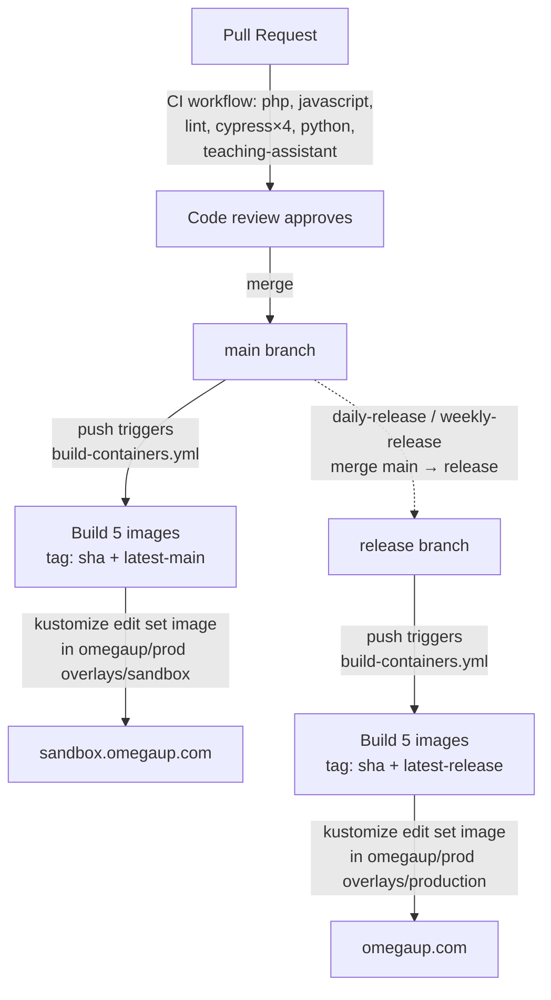

# Liberação e implantação

Esta página rastreia o caminho exato que uma mudança percorre desde uma solicitação pull mesclada até a execução em [omegaup.com](https://omegaup.com): os fluxos de trabalho do GitHub Actions que a controlam e a criam, as cinco imagens Docker que enviamos, as duas ramificações de longa duração (`main` e `release`) que substituem nossos dois ambientes e a transferência de GitOps que finalmente transfere as novas imagens para o cluster Kubernetes. Tudo aqui está em [`.github/workflows/`](https://github.com/omegaup/omegaup/tree/main/.github/workflows) e [`stuff/docker/`](https://github.com/omegaup/omegaup/tree/main/stuff/docker) no repositório [`omegaup/omegaup`](https://github.com/omegaup/omegaup) — em caso de dúvida, leia o YAML, porque essa é a fonte da verdade e esta página é apenas o mapa.

!!! resumo "O modelo mental de um parágrafo"
    Duas filiais, dois ambientes. A fusão de um PR no `main` cria novas imagens e as envia para **sandbox** ([sandbox.omegaup.com](https://sandbox.omegaup.com)). Um trabalho agendado então avança esses mesmos commits de `main` para `release`, que cria as imagens idênticas novamente e as envia para **produção**. Nada é implementado copiando arquivos em um servidor — um fluxo de trabalho reescreve uma tag de imagem no repositório de manifestos privado [`omegaup/prod`](https://github.com/omegaup/prod) e o cluster se reconcilia para corresponder. Portanto, "implantar" é, na verdade, "confirmar uma nova tag de imagem" e uma reversão é "confirmar a tag antiga".

## Duas filiais são os dois ambientes

Não marcamos versões semânticas do frontend e as entregamos a uma equipe de operações. Em vez disso, duas ramificações no repositório *são* a superfície de implantação, e todo o seu trabalho é espelhar o que está ativo atualmente:

- **`main`** contém as alterações mais recentes que a equipe de revisão aprovou. Cada PR mesclado chega aqui, e cada pouso é reconstruído e reimplantado **sandbox**. O sandbox está deliberadamente uma volta à frente da produção para que uma mudança ruim seja detectada por nós no `sandbox.omegaup.com` antes que usuários reais no `omegaup.com` a vejam - a frase do wiki é que o sandbox "nos dá um buffer em caso de erros nas mudanças mais recentes", e esse buffer é precisamente a janela na qual podemos reverter um commit no `main` antes que ele seja promovido.
- **`release`** espelha o que está sendo executado em **produção**. Você nunca mescla um PR em `release` manualmente; um fluxo de trabalho agendado mescla `main` nele para você (consulte [Promoção agendada](#scheduled-promotion-to-production) abaixo). Como o `release` só avança absorvendo commits já revisados ​​e já no sandbox do `main`, a produção é, por construção, um subconjunto estrito do que o sandbox já sobreviveu.

É por isso que você nunca deve se comprometer diretamente com `release` e porque o trabalho de promoção usa uma mesclagem em vez de um push forçado: `release` deve sempre ser um verdadeiro ancestral-plus de `main`, nunca uma história divergente.

## Todo o caminho, de ponta a ponta

Aqui está a jornada completa de um commit, que o restante da página descompacta etapa por etapa:

## Estágio 1 — CI deve passar antes da fusão

Antes que um PR possa ser mesclado em `main`, ele deve estar verde no fluxo de trabalho [`CI`](https://github.com/omegaup/omegaup/blob/main/.github/workflows/ci.yml), que é executado em cada `pull_request` e em cada `push` a `main` (e também é exposto como um `workflow_call` reutilizável). Um grupo `concurrency` digitado no número PR cancela qualquer execução em andamento quando você envia um novo commit - `cancel-in-progress: true` - para que você nunca queime executores testando duas vezes uma revisão obsoleta.

CI não é uma verificação, mas uma distribuição de trabalhos, e a porta antes de todos eles é `verify-action-hashes`: ele executa [`./hack/gha-reversemap.sh verify-mapusage`](https://github.com/omegaup/omegaup/blob/main/hack/gha-reversemap.sh) para confirmar que cada ação GitHub de terceiros está fixada em um SHA de commit completo em vez de uma tag mutável como `@v4`. Essa é uma defesa da cadeia de suprimentos – uma tag pode ser apontada novamente para um código malicioso abaixo de você, um SHA de 40 caracteres não pode – e é por isso que você verá `actions/checkout@34e114876b0b11c390a56381ad16ebd13914f8d5` em todos os lugares, em vez de `@v4` em nossos fluxos de trabalho.

Os trabalhos de teste reais são executados em paralelo:

| Trabalho | O que realmente faz | Pins e tempos limite notáveis ​​|
|-----|-----------------------|--------------------------|
| **php** | Testes de controlador/lib do PHPUnit via [`./stuff/mysql_types.sh`](https://github.com/omegaup/omegaup/blob/main/stuff/mysql_types.sh), em seguida, análise estática do Salmo e, em seguida, upload do Codecov | Ativa contêineres de serviço `mysql:8.0.34` na porta **13306**, `redis` e `rabbitmq:3-management-alpine`; roda em **PHP 8.1** com cobertura APCu e XDebug habilitada; `timeout-minutes: 20` |
| **javascript** | `yarn test:coverage` (testes de unidade Jest sobre os componentes Vue/TS) e, em seguida, upload do Codecov | **Nó 20** com cache de fios; `timeout-minutes: 10` |
| **lint** | `./stuff/lint.sh validate --all` dentro do contêiner `omegaup/hook_tools:v1.0.9`, mais Salmo sobre a árvore PHP, mais `./stuff/unused_translation_strings.py`, mais uma verificação de que `APITool.php --file api.py` ainda emite Python válido | Reutiliza a imagem hook_tools fixada para que o local e o CI linting concordem byte por byte |
| **cipreste** | Testes de navegador ponta a ponta, `cypress run --browser chrome`, fragmentados em uma matriz de 4 vias | `timeout-minutes: 25`; espera no `grader:21680` antes de iniciar (veja abaixo) |
| **píton** | `pytest` sobre `stuff/` (cronjobs, ferramentas de migração e scripts auxiliares) dentro do contêiner `frontend` | `--timeout=20` por teste |
| **auxiliar de ensino** | Exercita o trabalhador editorial de IA de ponta a ponta no modo de curso e no modo de submissão | Executa o `teaching_assistant.py` real em um curso inicializado |

Vale a pena internalizar dois detalhes no trabalho **php** porque são exatamente o que quebra quando um PR toca o esquema. Primeiro, antes de qualquer teste ser executado, o CI baixa o binário **Go gitserver** — `omegaup-gitserver.tar.xz` de [versão `omegaup/gitserver` `v1.9.13`](https://github.com/omegaup/gitserver/releases/tag/v1.9.13) — mais `libinteractive.jar` `v2.0.27`, porque os testes PHP precisam de um gitserver ativo para armazenar repositórios git problemáticos. Este é um lembrete concreto de que a pilha do avaliador reside em *outros* repositórios ([`omegaup/quark`](https://github.com/omegaup/quark) para o avaliador/executor/transmissor, [`omegaup/gitserver`](https://github.com/omegaup/gitserver) para armazenamento de problemas) e é consumido aqui como artefatos de liberação fixados, nunca construídos a partir deste monorepo.

Em segundo lugar, o CI valida as migrações de banco de dados *como migrações*, não apenas executando-as: [`stuff/db-migrate.py validate`](https://github.com/omegaup/omegaup/blob/main/stuff/db-migrate.py) verifica os scripts em [`frontend/database/`](https://github.com/omegaup/omegaup/tree/main/frontend/database), então `db-migrate.py migrate --databases=omegaup-test` os aplica a um MySQL novo e, finalmente, `stuff/policy-tool.py validate` e `stuff/database_schema.py validate` afirmam que o esquema resultante corresponde à política de check-in. Se você adicionar uma coluna, mas esquecer de gerar novamente o esquema, esse será o trabalho que falhará – muito antes da produção.

!!! note "Por que Cypress espera no `grader:21680`"
    A etapa e2e executa `wait-for-it -t 30 grader:21680` antes de iniciar o Chrome. A porta **21680** é o endpoint HTTP do avaliador (o mesmo padrão `OMEGAUP_GRADER_URL` de `https://localhost:21680` que o cliente PHP `\OmegaUp\Grader` disca na produção). Um teste de fluxo de envio que começa antes que o avaliador esteja ouvindo falharia, de modo que todo o fragmento Cypress seria bloqueado naquela porta que estava chegando.

### Cypress é executado em quatro fragmentos

O conjunto Cypress é deliberadamente dividido em uma matriz `fail-fast: false` de quatro fragmentos para que o custo do relógio de parede de aproximadamente 25 minutos seja pago em paralelo em vez de serialmente, e assim uma especificação instável não cancela as outras:

| Fragmento | Nome | Especificações |
|-------|------|-------|
| 1 | `contest-group` | `contest.cy.ts`, `problem_collection.cy.ts`, `group.cy.ts` |
| 2 | `courses` | `course_2Part.cy.ts`, `course.cy.ts`, `certificate.cy.ts`, `navigation.cy.ts` |
| 3 | `ide-basics` | `ide.cy.ts`, `basic_commands.cy.ts` |
| 4 | `problem-creator` | `problem_creator.cy.ts` |

Em caso de falha, cada fragmento carrega suas capturas de tela e vídeos como artefatos de execução (protegidos por `if: always() && hashFiles(...)`) e despeja `docker logs` de cada contêiner em execução no `frontend/tests/runfiles/containers/` — portanto, quando uma execução fica vermelha, a evidência já está anexada à execução do fluxo de trabalho e você não precisa reproduzir localmente para ver o que o navegador viu.

## Estágio 2 — mesclar com `main` cria e implanta sandbox

No momento em que seu PR revisado é mesclado, o push para `main` é acionado [`build-containers.yml`](https://github.com/omegaup/omegaup/blob/main/.github/workflows/build-containers.yml). Este é o fluxo de trabalho que transforma a origem em artefatos entregáveis. Ele é acionado em pushes para **ambos** `main` e `release`, e o branch em que ele é acionado decide qual ambiente será direcionado — mesmas etapas de construção, destino de implantação diferente no final.

### As cinco imagens que construímos

A etapa de construção executa `docker compose --file=docker-compose.k8s.yml build` com `DOCKER_BUILDKIT=1` e `TAG=${{ github.sha }}`, construindo cinco serviços declarados em [`docker-compose.k8s.yml`](https://github.com/omegaup/omegaup/blob/main/docker-compose.k8s.yml). Quatro deles são alvos de estágio de um único estágio múltiplo [`Dockerfile.frontend`](https://github.com/omegaup/omegaup/blob/main/stuff/docker/Dockerfile.frontend); o quinto tem seu próprio Dockerfile:

| Imagem | Construir alvo | O que há dentro e por quê |
|-------|-------------|------------|
| **`omegaup/php`** | Estágio `php`, `ubuntu:jammy` | O tempo de execução do aplicativo: `php8.1-fpm` mais `php8.1-{apcu,curl,gmp,mbstring,mysql,opcache,redis,xml,zip}`, o agente PHP New Relic, `openjdk-18-jre-headless` e `libinteractive.jar` (necessário para problemas interativos). Executa `php-fpm8.1 --nodaemonize --force-stderr` na porta **9001**; `STOPSIGNAL SIGQUIT` para que o php-fpm seja drenado normalmente em vez de descartar solicitações em andamento |
| **`omegaup/nginx`** | Estágio `nginx`, `ubuntu:jammy` | O servidor web que termina o HTTP na porta **8001** e entrega solicitações PHP ao contêiner php-fpm |
| **`omegaup/frontend`** | Estágio `frontend`, `alpine:latest` | Não é um serviço em execução - uma imagem de dados finos que carrega o `/opt/omegaup` *construído* (pacotes de webpack compilados, árvore de fornecedores `composer install --no-dev`, modelos Twig pré-compilados) e `rsync`s no lugar para os outros servirem |
| **`omegaup/frontend-sidecar`** | Estágio `frontend-sidecar`, `ubuntu:jammy` | Fornece `mysql-client-core-8.0`, `git` e os requisitos do Python – este é o pod que executa migrações de banco de dados e manutenção junto com o aplicativo |
| **`omegaup/ai-editorial-worker`** | [`Dockerfile.ai-editorial-worker`](https://github.com/omegaup/omegaup/blob/main/stuff/docker/Dockerfile.ai-editorial-worker) | O trabalhador Python que gera editoriais/feedback de IA (o mesmo código dos exercícios de trabalho de CI `teaching-assistant`) |

O trabalho pesado acontece no estágio `build` compartilhado. Ele clona o repositório em `--branch=${BRANCH}` (`release` padrão, substituído por execução pelo `--build-arg BRANCH=<branch>` que o fluxo de trabalho passa), então: constrói o pacote reKarel (`npm install && npx gulp && npm run build` em `frontend/www/rekarel`), executa `yarn build` para produzir os ativos Webpack 5, executa `composer install --no-dev --classmap-authoritative` para um otimizado autoloader, grava um `config.php` de produção (`OMEGAUP_ENVIRONMENT = 'production'`, implementação de cache `none`, `TEMPLATE_CACHE_DIR = /var/lib/omegaup/templates`) e, finalmente, executa [`CompileTemplatesCmd.php`](https://github.com/omegaup/omegaup/blob/main/frontend/server/cmd/CompileTemplatesCmd.php) para pré-compilar os modelos Twig em `/var/lib/omegaup/templates`. Compilar modelos em tempo de construção é o motivo pelo qual a produção nunca paga o custo de compilação do Twig na primeira solicitação após a implantação.

### Cada imagem é marcada duas vezes, enviada para dois registros

Após a compilação, o fluxo de trabalho faz login em **ambos** registros e envia cada uma das cinco imagens sob **duas** tags:

- **`${{ github.sha }}`** — a tag imutável de confirmação exata. Este é aquele ao qual as implantações realmente se fixam, portanto, uma determinada implementação de produção é rastreável a um commit específico e nunca pode ser desviada silenciosamente.
- **`latest-<branch>`** — um ponteiro móvel (`latest-main` ou `latest-release`) para humanos e ferramentas que desejam apenas "a mais nova construção de sandbox/prod".

Ambos os conjuntos de tags vão para o GitHub Container Registry (`ghcr.io/omegaup/...`, autenticado com o `github.token` da execução) *e* para o Docker Hub (`omegaup/...`, autenticado com os segredos `DOCKER_USERNAME`/`DOCKER_PASSWORD`). Publicar em dois registros é redundância proposital: se um estiver inativo ou com limitação de taxa durante uma implantação, o cluster ainda poderá extrair do outro.

### GitOps: a implantação é um compromisso com `omegaup/prod`

Aqui está a etapa que surpreende as pessoas pela primeira vez: nada neste fluxo de trabalho faz SSH em um servidor ou reinicia um serviço. Em vez disso, em um push `main`, a etapa final (guardada por `if: github.ref == 'refs/heads/main'`) clona o repositório de manifestos privado [`omegaup/prod`](https://github.com/omegaup/prod), `cd`s em `k8s/omegaup/overlays/sandbox/frontend` e executa `kustomize edit set image` para reescrever todas as cinco referências de imagem para a nova tag `${{ github.sha }}`, corrige o Rótulo `app.kubernetes.io/version` para o mesmo SHA e, em seguida, `git commit` + `git push` como `omegaup-bot`.

Esse commit é o deploy. Um reconciliador GitOps observando `omegaup/prod` percebe que o manifesto foi alterado e rola a implantação da sandbox para as novas imagens. Em vez disso, para enviar para produção, a etapa *idêntica* é executada atrás de `if: github.ref == 'refs/heads/release'` e edita `overlays/production/frontend` em vez de `overlays/sandbox/frontend`. As mesmas cinco linhas `kustomize edit set image`, a mesma fixação SHA, diretório de sobreposição diferente - essa única condicional é toda a diferença entre "implantar no sandbox" e "implantar na produção".

## Promoção programada para produção

A produção não é implantada por um clique humano em um botão. Dois fluxos de trabalho programados promovem `main` em `release` e, uma vez que `release` é movido, o [Estágio 2](#stage-2-merge-to-main-builds-and-deploys-sandbox) faz o resto automaticamente:- [`daily-release.yml`](https://github.com/omegaup/omegaup/blob/main/.github/workflows/daily-release.yml) — `cron: '0 3 * * 0'`, ou seja, **Domingos às 03:00 UTC (20:00 PT)**. Apesar do nome, atualmente funciona semanalmente, não diariamente; o arquivo ainda carrega um `TODO(#1624): Make this daily once we have better coverage of the frontend`, o que é uma observação sincera de que ainda não confiamos no pacote automatizado o suficiente para promovê-lo todos os dias.
- [`weekly-release.yml`](https://github.com/omegaup/omegaup/blob/main/.github/workflows/weekly-release.yml) — `cron: '0 3 * * 1'`, ou seja, **Segundas-feiras às 03:00 UTC (Domingo às 20:00 PT)**.

Ambos fazem a mesma coisa principal: eles `POST` para a API GitHub `/repos/omegaup/omegaup/merges` com `{"base":"release","head":"main"}`, autenticado com o segredo `OMEGAUPBOT_RELEASE_TOKEN`, para mesclar `main` em `release`. Eles analisam a resposta JSON e falham se faltar um commit `sha` ou retornar `merged: false`, portanto, uma promoção com falha silenciosa não pode ser mascarada como sucesso. Ambos também podem ser iniciados fora da banda por meio de um `repository_dispatch` do tipo `daily-release` / `weekly-release` quando alguém precisar interromper um lançamento fora do cronograma.

Os dois fluxos de trabalho diferem exatamente em uma proteção, e ela é importante.

!!! aviso "O lançamento diário se recusa a enviar alterações de esquema"
    Antes da fusão, `daily-release.yml` executa `git diff --quiet origin/release:frontend/database origin/main:frontend/database` e **aborta a versão** se houver alguma diferença. Em termos simples: o caminho de lançamento rápido e frequente não levará sozinho a migração do banco de dados para produção. As alterações de esquema são mantidas para o caminho `weekly-release` (que não tem essa verificação), para que uma migração chegue à produção em uma cadência previsível com observação humana, em vez de deslizar para fora em um cron diário automatizado. Este é o motivo pelo qual seu PR que toca no esquema pode ficar na sandbox por vários dias antes de chegar a `omegaup.com`.

!!! note "Pausando todas as versões com `.pause-release`"
    Ambos os fluxos de trabalho verificam primeiro o `git cat-file -e origin/main:.pause-release` e ignoram o lançamento se esse arquivo existir no `main`. Portanto, o interruptor para "não promover nada para produção agora" - durante um incidente, um congelamento ou uma janela sabidamente ruim - é simplesmente enviar um arquivo chamado [`.pause-release`](https://github.com/omegaup/omegaup) na raiz do repositório. Exclua-o para retomar. Sem edições de fluxo de trabalho, sem rotação secreta, apenas um arquivo cuja mera presença interrompe o cron.

## Lançamento de serviços de back-end em sua própria cadência

Tudo acima vem com o **frontend** (o aplicativo PHP/nginx/Vue). A pilha do avaliador é um código separado com controle de versão separado, e você pode ler suas versões fixadas atuais diretamente de [`docker-compose.yml`](https://github.com/omegaup/omegaup/blob/main/docker-compose.yml):

| Serviço | Imagem (atualmente) | Repositório de origem |
|---------|-------------------|---------|
| Graduador | `omegaup/backend:v1.9.35` | [`omegaup/quark`](https://github.com/omegaup/quark) |
| Emissora | `omegaup/backend:v1.9.35` | [`omegaup/quark`](https://github.com/omegaup/quark) |
| Corredor | `omegaup/runner:v1.9.35` | [`omegaup/quark`](https://github.com/omegaup/quark) |
| Gitserver | `omegaup/gitserver:v1.9.13` | [`omegaup/gitserver`](https://github.com/omegaup/gitserver) |

Essas são tags de versão semântica fixadas, alteradas deliberadamente quando uma nova versão do avaliador/corredor é cortada no `omegaup/quark` - não reconstruídas em cada mesclagem de front-end como são as cinco imagens do aplicativo. O front-end chega ao avaliador por HTTP em `OMEGAUP_GRADER_URL` (padrão `https://localhost:21680`), portanto, uma implantação de front-end e uma implantação de avaliador são eventos genuinamente independentes. Quando você está diagnosticando um problema de produção, esta separação é importante: um veredicto de envio quebrado é muito provavelmente uma preocupação de back-end do `v1.9.35` no `omegaup/quark`, enquanto uma renderização de página quebrada é uma preocupação de imagem de front-end neste repositório.

## Revertendo

Como uma implantação é apenas um commit que fixa uma imagem SHA em `omegaup/prod`, uma reversão é o mesmo movimento ao contrário: aponte o manifesto de volta para a tag `${{ github.sha }}` anterior e deixe o cluster se reconciliar. Cada compilação histórica ainda está em ambos os registros sob seu commit SHA imutável, portanto há sempre uma tag concreta para reverter *para* — você nunca está reconstruindo para recuperar, apenas fixando novamente.

Isso é exatamente o que o "buffer" da sandbox nos compra na prática. Como `main`/sandbox sempre é executado antes de `release`/produção, uma regressão geralmente surge primeiro em `sandbox.omegaup.com` e a reversão do commit ofensivo em `main` (que reconstrói o sandbox) evita que ele seja promovido para `release` na próxima janela agendada. A reversão mais barata é aquela em que a alteração ruim nunca chega à produção porque o sandbox a detectou e o `.pause-release` ganhou tempo.

!!! perigo "As migrações de banco de dados são a única coisa que você não pode reverter trivialmente"
    As reversões de imagens são baratas e totais; mudanças de esquema não são. Esta é a razão pela qual o `daily-release.yml` isola o `frontend/database` do caminho automatizado. Grave migrações para serem compatíveis com versões anteriores — a imagem anterior deve ser capaz de ser executada no novo esquema — para que a reversão da *imagem* não exija a reversão do *esquema*. Se você precisar reverter uma migração, isso será uma operação deliberada e executada por humanos no banco de dados, e não algo que uma reversão de manifesto faça por você.

## Documentação Relacionada

- **[Monitoramento](monitoring.md)** — New Relic, Prometheus e as métricas a serem observadas após uma implantação
- **[Solução de problemas](troubleshooting.md)** — falhas comuns e como ler os logs
- **[Docker Setup](docker-setup.md)** — o `docker-compose.yml` local empilha essas imagens espelhadas
- **[Testes](../development/testing.md)** — os conjuntos de testes que controlam cada mesclagem no Estágio 1
