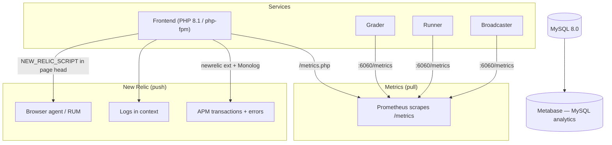

# Monitoramento

omegaUp não é um programa, mas uma frota deles: o frontend PHP por trás do nginx, o classificador Go, seus executores, o transmissor e o gitserver, todos conversando com MySQL, Redis e RabbitMQ. Quando um concurso está no ar e alguns milhares de pessoas estão enfrentando os mesmos três problemas, "o site está bom?" deixa de ser uma pergunta sim/não e se torna "a fila está diminuindo, os executores estão vivos e algum método de API lança repentinamente 500?" Essa é a pergunta que a pilha de observabilidade existe para responder, e ela a responde com um conjunto pequeno e deliberadamente enfadonho de ferramentas: **Prometheus** para os números, **New Relic** para rastreamentos, erros e logs no contexto, e **Metabase** para produtos pós-fato e análise de dados. As próprias implantações são monitoradas pelo **Argo CD**, que reconcilia o que realmente está em execução no cluster Kubernetes com o que o Git diz que deveria estar em execução.

Nada aqui é exótico de propósito. Cada serviço publica texto simples do Prometheus em um endpoint `/metrics`, cada solicitação PHP enriquece uma transação New Relic se o agente estiver presente e silenciosamente não faz nada se não estiver, e tudo se degrada para "ainda funciona, apenas cego" em um contêiner de desenvolvimento onde nenhum dos agentes está instalado.

## Visão geral

A divisão importante para manter em sua cabeça: **Prometheus puxa, New Relic empurra.** Prometheus estende a mão e raspa um ponto final que você expõe; O agente PHP da New Relic e o enriquecedor Monolog enviam dados de dentro da solicitação. É por isso que uma caixa com firewall ou sem agente ainda produz métricas do Prometheus (desde que o raspador possa alcançá-la), mas não produz nenhum dado do New Relic.

## Prometeu: os números

### A interface PHP

A integração do frontend Prometheus é um único wrapper pequeno, `\OmegaUp\Metrics` em `frontend/server/src/Metrics.php`, construído no cliente `promphp/prometheus_client_php` (atualmente fixado em `^v2.4.0` em `composer.json`). Na construção, ele escolhe um adaptador de armazenamento com base na disponibilidade do APCu: `\Prometheus\Storage\APC` em produção (para que os contadores sobrevivam às solicitações na memória compartilhada do pool de trabalhadores php-fpm) e `\Prometheus\Storage\InMemory` como substituto, que redefine todas as solicitações e é realmente útil apenas em testes. Essa escolha é importante: se o APCu estiver faltando, seus contadores serão redefinidos silenciosamente a cada solicitação e suas taxas parecerão um ruído.

Há exatamente um lugar que grava métricas de aplicativos hoje: o próprio funil de solicitação. `\OmegaUp\ApiCaller::call()` (`frontend/server/src/ApiCaller.php`) chama `\OmegaUp\Metrics::getInstance()->apiStatus($methodName, $status)` duas vezes: uma vez no caminho de sucesso com status `200` e uma vez no caminho de falha com o código HTTP da exceção de API real. Cada chamada atinge dois contadores:

- `frontend_api_request_status_count{api, status}` — um contador digitado pelo nome do método API (por exemplo, `/api/run/create/` aparece como o método) **e** o código de status resultante, para que você possa perguntar "quantos 401s `run.create` lançou nos últimos cinco minutos" com um único `rate()`.
- `frontend_api_request_total{api}` — a mesma coisa sem o rótulo de status, ou seja, total de chamadas por método, que é o denominador quando você deseja uma *proporção* de erro em vez de uma *contagem* de erro.

Esses dois são suficientes para calcular os dois sinais que realmente prevêem uma interrupção: taxa de solicitação por endpoint e a fração deles que não são `200`. Não há histograma de latência por endpoint no lado do PHP hoje - a latência reside no New Relic (veja abaixo), porque é aí que você também obtém o gráfico em degradê para explicar *por que* uma chamada foi lenta, o que um número simples do Prometheus não pode fornecer.

O Prometheus raspa o frontend em `frontend/www/metrics.php`, que é o mais fino que uma página pode ter: requer `bootstrap.php` e chama `\OmegaUp\Metrics::getInstance()->render()`. `render()` define `Content-type: text/plain` (via `\Prometheus\RenderTextFormat::MIME_TYPE`) e ecoa o formato de exposição. Aponte um trabalho de raspagem para esse caminho e pronto.

### O aluno

O avaliador é o componente que você realmente observa durante uma competição e é o mais instrumentado. Suas métricas residem no repositório Go `omegaup/quark` em `cmd/omegaup-grader/metrics.go`, servido por `promhttp.Handler()` em uma porta dedicada – `Metrics.Port`, cujo padrão é `6060` (consulte `MetricsConfig` em `common/context.go`). Tudo tem o namespace `quark` com o subsistema `grader`, portanto, os nomes dos fios são `quark_grader_*`.

Os medidores de fila são o centro disso, e há um por nível de prioridade porque o avaliador mantém filas separadas em vez de uma grande:

| Métrica | O que isso diz a você |
|--------|-------------------|
| `quark_grader_queue_total_length` | Tudo esperando, em todas as filas. O único número para alertar. |
| `quark_grader_queue_high_length` | Backlog de alta prioridade – envios interativos/concursos que as pessoas estão olhando. |
| `quark_grader_queue_normal_length` | Backlog de prioridade normal. |
| `quark_grader_queue_low_length` | Backlog de baixa prioridade (rejulgamentos e outros trabalhos em massa que não devem privar as filas ativas). |
| `quark_grader_queue_ephemeral_length` | A fila efêmera, usada pelas execuções scratch "run this in the arena" que nunca tocam o banco de dados. |

Junto com cada fila está um resumo, `quark_grader_queue_delay_seconds` (e o `quark_grader_queue_{high,normal,low,ephemeral}_delay_seconds` por camada), que mede quanto tempo uma corrida ficou na fila antes de um corredor retirá-la. Eles são exportados com objetivos quantílicos `0.5`, `0.9` e `0.99` (os alvos `{0.5: 0.05, 0.9: 0.01, 0.99: 0.001}` no código), então `quark_grader_queue_delay_seconds{quantile="0.99"}` é sua espera p99 - o número honesto "quão ruim é para o remetente mais azarado no momento", que é exatamente o que importa quando o comprimento da fila parece bom em média, mas alguns envios estão presos por um problema lento.

O rendimento e a integridade vêm de contadores e de um vetor de medidor:

- `quark_grader_runs_total` — cada corrida graduada. Seu `rate()` é o seu envio por segundo.
- `quark_grader_ephemeral_runs_total`, `quark_grader_ci_jobs_total` — as variantes de execução temporária e CI problemático, contadas separadamente para que a atividade de CI em massa não se disfarce como carga de concurso.
- `quark_grader_runs_retry`, `quark_grader_runs_abandoned` — uma corrida é repetida quando seu corredor desaparece no meio da rampa; ele é *abandonado* quando tentar novamente não ajuda. Um `runs_abandoned` crescente é a métrica que diz que “as execuções estão sendo descartadas silenciosamente”, o que é muito pior do que uma fila lenta.
- `quark_grader_runs_je` — execuções que terminaram com um veredicto `JE` (Erro do Juiz). Isso deve ser zero; qualquer inclinação significa que a própria motoniveladora está quebrada, e não o código enviado.
- `quark_grader_runner_up{runner_hostname, runner_public_ip}` — um medidor definido como `1` para cada corredor de quem o avaliador ouviu falar recentemente. O avaliador considera um corredor vivo somente se ele tiver feito check-in nos últimos 3 minutos (o ponto de corte `-3 * time.Minute` em `gaugesUpdate`); uma vez que um corredor fica obsoleto, todo o vetor é `Reset()` e repovoado, então um corredor que morre simplesmente desaparece da série. Resumir esse medidor fornece a contagem de corredores ao vivo, e observá-la cair é como você pega um anfitrião de corredor caindo antes que a fila recue visivelmente.

A niveladora também exporta sinais vitais do host como `os_cpu_load1` / `os_cpu_load5` / `os_cpu_load15`, `os_mem_total` / `os_mem_used` e `os_disk_total` / `os_disk_used`, atualizados uma vez por minuto por um ticker em `gaugesUpdate()` (via `gopsutil` do `load`, auxiliares `mem` e `disk`). `disk_used` subindo em direção a `disk_total` é o clássico eliminador de niveladoras silenciosas – a caixa se enche de entradas de problemas e paradas de nivelamento – então ele ganha seu próprio medidor.

Um endpoint extra que vale a pena conhecer: junto com `/metrics`, o avaliador atende `/metrics/runners`, que retorna uma lista JSON dos executores atualmente ativos no formato Prometheus **descoberta de serviço de arquivo** (`targets` + `labels`, novamente usando o corte de atualização de 3 minutos). É assim que o Prometheus aprende quais caixas de corredores devem ser raspadas sem que ninguém edite manualmente uma lista de alvos toda vez que a frota de corredores aumenta ou diminui.

### O corredor e o locutor

Cada executor expõe seu próprio `/metrics` (mesmo namespace `quark`, subsistema `runner`). As séries de suporte de carga são `quark_runner_validator_errors` (uma contagem crescente aqui significa que os validadores personalizados estão travando, o que silenciosamente transforma envios corretos em veredictos errados) além de uma família de medidores `quark_benchmark_*` - `io_time`, `cpu_time`, `memory_time` e seus companheiros `_wall_time` / `_memory` - que registram o desempenho da caixa em relação a um benchmark conhecido, então você pode diferenciar um corredor genuinamente sobrecarregado de outro que acabou de enfrentar um problema pesado. Ele também relata os mesmos sinais vitais do host `os_*` que a motoniveladora.

A emissora – o serviço que os fãs contestam eventos para navegadores por meio de SSE e WebSockets – exporta (subsistema `broadcaster`): `broadcaster_websockets_count` e `broadcaster_sse_count` (conexões atualmente abertas de cada tipo), `broadcaster_messages_total` (mensagens enviadas) e `broadcaster_channel_drop_total`. Esse último é o alarme: uma gravação de canal perdida significa que um cliente estava muito lento para acompanhar e foi cortado, então a subida do `channel_drop_total` durante uma competição significa que as pessoas estão perdendo atualizações do placar ao vivo. A latência de despacho e processamento vem dos resumos `broadcaster_dispatch_latency_seconds` e `broadcaster_process_latency_seconds`.

Cada serviço Go também emite um contador `build_info` carregando rótulos const `version` e `go_version`, que existem apenas para que você possa confirmar no Prometheus qual versão binária está realmente sendo executada em cada host após uma implantação - útil quando uma implementação é aplicada pela metade e metade dos executores estão na versão antiga.

## O status da fila voltada para o aplicativo

Prometheus é a visão do operador. Há um segundo caminho de status separado destinado ao próprio aplicativo. `\OmegaUp\Grader::status()` em `frontend/server/src/Grader.php` emite uma solicitação `curl` para `OMEGAUP_GRADER_URL . '/grader/status/'` (com `OMEGAUP_GRADER_URL` padronizado como `https://localhost:21680`) e recebe de volta um pequeno blob JSON - `run_queue_length`, `runner_queue_length`, `runners`, `broadcaster_sockets` e `embedded_runner` — apresentado por meio de `\OmegaUp\Controllers\Grader::apiStatus()`. É isso que renderiza o pequeno indicador de fila dentro do site, não o que o Prometheus raspa. Em um ambiente de desenvolvimento em que `OMEGAUP_GRADER_FAKE` está definido, `status()` entra em curto-circuito e retorna uma estrutura totalmente zeros para que a IU não apresente erros quando não houver nenhum avaliador real por trás dele. Não use isso para criar painéis – é um instantâneo de um momento específico sem histórico; é para isso que serve o raspador `/metrics`.

## New Relic: rastreamentos, erros e logs no contexto

Enquanto Prometheus diz *que* algo está lento ou falhando, New Relic diz *qual linha* e *para quem*. A integração tem três pontas, e todas as três são escritas para serem autônomas quando o agente não está instalado, porque os contêineres de desenvolvimento não enviam a extensão PHP `newrelic` e ninguém quer que o aplicativo seja interrompido lá.

**Nomeação de transação.** `\OmegaUp\Request` chama `\OmegaUp\NewRelicHelper::nameTransaction("/api/{$this->methodName}")` para que cada chamada de API apareça no New Relic com seu próprio nome — `run.create`, `contest.details` e assim por diante — em vez de tudo se transformar em uma transação `index.php` anônima. Sem isso, a latência do APM é inútil porque não é possível saber qual endpoint é o mais lento.**Relatório de erros.** Quando `ApiCaller::call()` captura uma exceção que não foi tratada de outra forma, ele a encaminha através de `\OmegaUp\NewRelicHelper::noticeError()`, que encaminha para `newrelic_notice_error()` — mas somente depois que `isAvailable()` confirmar que a extensão foi carregada e as funções existem. `NewRelicHelper` (`frontend/server/src/NewRelicHelper.php`) é a costura inteira: `noticeError`, `nameTransaction`, `addCustomAttribute` e um `getStatus()` que você pode chamar para depurar se o agente está conectado. Cada método protege primeiro o `extension_loaded('newrelic')`, e é exatamente por isso que o mesmo código funciona bem em um laptop sem agente.

**Logs em contexto.** O root logger é configurado uma vez no `frontend/server/bootstrap.php`. Ele constrói um Monolog `Logger` chamado `omegaup` gravando em `OMEGAUP_LOG_FILE` (padrão `/var/log/omegaup/omegaup.log`) no nível `OMEGAUP_LOG_LEVEL` (padrão `info`), e aqui está a parte inteligente: se `\NewRelic\Monolog\Enricher\Formatter` existir (do pacote `newrelic/monolog-enricher`), ele usa esse formatador e envia um `\NewRelic\Monolog\Enricher\Processor` no registrador; caso contrário, ele volta para um `\Monolog\Formatter\LineFormatter` simples. O enriquecedor carimba cada linha de log com os IDs de rastreamento/entidade do New Relic, que é o que permite pular de uma transação lenta diretamente para as linhas de log exatas que a solicitação foi emitida. Um `\Monolog\Processor\WebProcessor` é sempre adicionado (URL de solicitação, método, IP), e `\Monolog\ErrorHandler::register()` conecta os próprios erros do PHP ao mesmo logger para que um fatal não escape sem registro.

**Agente de navegador (RUM).** O frontend também pode injetar o script de navegador do New Relic no cabeçalho da página. O shell Twig `frontend/templates/template.tpl` emite `{{ NEW_RELIC_SCRIPT|raw }}` dentro de ``, portanto, o monitoramento do usuário real só é ativado quando o valor de configuração `NEW_RELIC_SCRIPT` é definido (o padrão é `null`, ou seja, desativado, em `config.default.php`, ao lado de `NEW_RELIC_SCRIPT_HASH`, que existe para que o script embutido possa ser listado como permitido no Política de Segurança de Conteúdo sem enfraquecê-la). É isso que captura o tempo real de carregamento da página de navegadores reais, em vez de apenas o tempo do lado do servidor.

## Metabase e Argo CD

Mais duas ferramentas completam o quadro, e ambas são nomeadas nas notas operacionais do omegaUp, e não na base de código, porque observam o sistema de fora.

**Metabase** é a camada de análise de dados e relatórios. Ele se conecta ao MySQL de produção e permite que as pessoas criem consultas e painéis sem SQL escrito à mão - as perguntas que ele responde são questões de produto ("quantos usuários resolveram pelo menos um problema este mês") em vez de questões operacionais ("a fila está acabando"). Historicamente, tem sido o mais esquisito do grupo; se estiver mostrando um erro de conexão, o link do Metabase para o banco de dados está inativo, não o site em si, e o site está perfeitamente bem sem ele.

**Argo CD** monitora implantações em vez de tráfego. É o controlador de entrega contínua para o cluster Kubernetes e trata o Git como a única fonte da verdade: ele compara continuamente o estado desejado declarado no repositório de implantação com o que realmente está em execução no cluster e sinaliza (ou reconcilia) qualquer desvio. Quando você quiser saber "minha mudança realmente foi implementada e todas as réplicas estão na nova versão", o status de sincronização do Argo CD é o primeiro lugar a procurar - e combina naturalmente com a métrica `build_info` acima, que confirma a mesma coisa da própria boca do binário em execução.

## Um exemplo prático: "os envios parecem lentos"

O objetivo de ter essas ferramentas é que um relatório vago resolve uma causa específica em algumas consultas. Quando alguém disser que os envios estão lentos durante um concurso, siga a cadeia em ordem de dependência:

1. **Foi realmente feito backup da fila?** Veja `quark_grader_queue_total_length` e o `quark_grader_queue_high_length` por camada. Se o total for estável e baixo, o avaliador está acompanhando e o problema está em outro lugar (frontend, rede). Se estiver subindo, continue.
2. **Os corredores estão desaparecendo?** Soma `quark_grader_runner_up`. Uma queda aqui – um host executor que parou de fazer check-in dentro da janela de 3 minutos – significa menos capacidade de avaliação e a fila aumentará, não importa quão saudável o avaliador esteja. Verifique com o Argo CD para ver se um lançamento ruim derrubou os corredores.
3. **O culpado é um único problema?** Verifique `quark_grader_queue_delay_seconds{quantile="0.99"}` em relação à mediana. Um p99 enorme com um p50 normal significa que a maioria das execuções está bem, mas algumas estão presas a um problema caro, não a uma falta geral de capacidade.
4. **A própria motoniveladora está errando em vez de apenas ficar lenta?** Observe `quark_grader_runs_retry` e especialmente `quark_grader_runs_abandoned` e `quark_grader_runs_je`. Qualquer inclinação em abandono ou JE significa que as corridas estão sendo abandonadas ou o juiz está quebrado – um incidente de correção, não de desempenho.
5. **Ou é o frontend, e não o avaliador?** De volta ao lado do PHP, `rate(frontend_api_request_status_count{api="run.create", status!="200"}[5m])` sobre `rate(frontend_api_request_total{api="run.create"}[5m])` fornece a taxa de erro para envios, e a transação `run.create` da New Relic (nomeada exatamente por esse motivo) mostra se o tempo está indo para o MySQL, a chamada HTTP do avaliador ou o próprio PHP - com as linhas de log enriquecidas dessa solicitação a um clique de distância.

## Uma nota sobre nomes de host

Os painéis, a conta New Relic, a instância do Metabase e o console do Argo CD residem em URLs privados e autenticados que não são publicados aqui propositalmente. Se você precisar de acesso, será uma conversa sobre credenciais e permissões com a equipe de manutenção, não um link colado em um navegador.

## Documentação Relacionada

- **[Solução de problemas](troubleshooting.md)** — transformando um sintoma em uma solução
- **[Infraestrutura](../architecture/infrastructure.md)** — como os serviços se encaixam
- **[Implantação](deployment.md)** — com o que o Argo CD está se reconciliando
