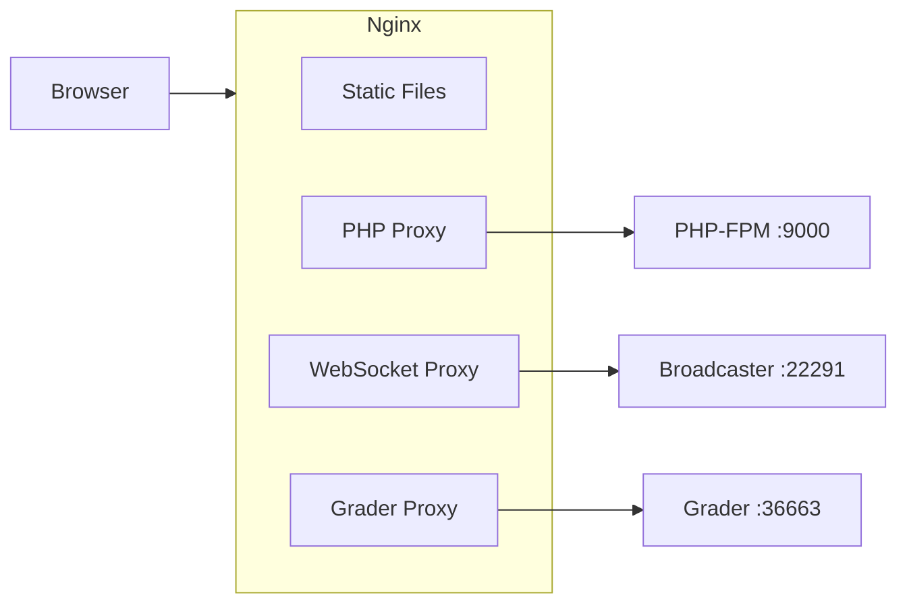

#Configuração Nginx

nginx é a única porta de entrada para o omegaUp. Cada solicitação que um navegador faz – uma página
carregamento, uma chamada `/api/`, um WebSocket para eventos de placar ao vivo, uma imagem do problema - chega
primeiro no nginx, e o nginx decide uma das três coisas: servir o arquivo diretamente do disco,
entregue-o ao php-fpm via FastCGI ou faça proxy reverso para um dos serviços Go de back-end.
Não há lógica de aplicação aqui; nginx é deliberadamente burro. Todo o seu trabalho é rotear
e cache, e a parte interessante é _por que cada rota existe_, porque a maioria delas
codifique uma decisão tomada anos atrás que é fácil de quebrar se você não souber o motivo.

Os dois arquivos que importam são `stuff/docker/etc/nginx/nginx.conf` (o bloco do servidor, o
php-fpm upstream, os dois proxies) e `frontend/server/nginx.rewrites` (o `/api/`
funil, cada URL bonito e os cabeçalhos de cache). O `.conf` `include`s o `.rewrites`
arquivo na parte inferior do bloco `server`, portanto, leia-os como um documento.

## Os três tipos de tráfego


Arquivos estáticos (os pacotes Webpack em `/dist/`, `/third_party/`, `/css`, `/js/`,
imagens) nunca toque em PHP - o nginx as lê `/opt/omegaup/frontend/www` e retorna
diretamente, que é o objetivo de colocar o nginx na frente de um interpretado
linguagem. Qualquer coisa que termine em `.php` e tudo em `/api/` (que é _reescrito_
para um arquivo `.php`, veja abaixo), vai para php-fpm em `127.0.0.1:9000`. Os dois longevos,
coisas com estado - o fluxo WebSocket em `/events/` e a web efêmera do aluno
interface em `/grader/` - obtenha proxy para os serviços de back-end Go separados, porque PHP
por trás do FastCGI não tem por que manter um soquete aberto durante um concurso.

## O bloco do servidor de desenvolvimento

A configuração dev reside em `stuff/docker/etc/nginx/nginx.conf` e é o que executa
dentro do contêiner `frontend`. É intencionalmente mínimo - um trabalhador efetua login
stderr então `docker-compose logs` os pega e tudo tem como escopo um único
Bloco `server`:

```nginx
daemon off;
pid /tmp/nginx.pid;
worker_processes 1;

error_log /dev/stderr error;

events {
  worker_connections 1024;
}

http {
  client_body_temp_path /tmp/client_body;
  fastcgi_temp_path /tmp/fastcgi_temp;
  proxy_temp_path /tmp/proxy_temp;
  scgi_temp_path /tmp/scgi_temp;
  uwsgi_temp_path /tmp/uwsgi_temp;
  access_log /dev/stderr;

  proxy_busy_buffers_size 512k;
  proxy_buffers 4 512k;
  proxy_buffer_size 256k;

  include /etc/nginx/mime.types;

  upstream php {
    server 127.0.0.1:9000;
  }

  server {
    listen 8001 default_server;
    listen [::]:8001 default_server ipv6only=on;
    port_in_redirect off;
    absolute_redirect off;

    root /opt/omegaup/frontend/www;
    index index.php index.html;
    # ...
  }
}
```
Algumas dessas linhas parecem clichês, mas suportam carga. Cada caminho temporário é
apontado para `/tmp` (`client_body_temp_path`, `fastcgi_temp_path`, `proxy_temp_path`,
e os scgi/uwsgi que o nginx insiste em criar mesmo que nunca os usemos) porque
o contêiner executa o nginx como um usuário **não root** que não pode gravar no padrão do nginx
Carretel `/var/lib/nginx`. Se você eliminar essas linhas, o nginx não será iniciado na primeira vez
precisa armazenar em buffer um upload grande ou uma resposta FastCGI grande - não no momento da análise de configuração,
mas no momento da solicitação, o que torna a depuração confusa.

`port_in_redirect off` e `absolute_redirect off` existem porque o servidor de desenvolvimento escuta
em **8001**, não em 80. Sem eles, quando o nginx emite um redirecionamento (digamos, adicionando um final
barra para um URL bonito) emitiria um `Location: http://host:8001/...` absoluto que
vaza a porta interna e quebra assim que a solicitação é encaminhada através do
mapeamento de porta externa. Desativar ambos faz com que o nginx envie redirecionamentos **relativos** e nunca
nomeie a porta, para que o navegador permaneça em qualquer host e esquema em que ele entrou.

## Entregando PHP para php-fpm

O upstream do `php` é `127.0.0.1:9000` — php-fpm escutando em uma porta TCP dentro do mesmo
recipiente. Tudo com um `.php` no caminho corresponde a este local e é aprovado
em FastCGI:

```nginx
location ~* "\.php(/|$)" {
  fastcgi_index index.php;
  fastcgi_keep_conn on;

  fastcgi_buffer_size 64k;
  fastcgi_buffers 16 32k;
  fastcgi_busy_buffers_size 64k;

  fastcgi_param SCRIPT_FILENAME $request_filename;
  fastcgi_param SCRIPT_NAME $fastcgi_script_name;
  fastcgi_param REQUEST_URI $request_uri;
  # ... QUERY_STRING, REQUEST_METHOD, CONTENT_TYPE, CONTENT_LENGTH,
  #     DOCUMENT_URI, DOCUMENT_ROOT, SERVER_PROTOCOL, REMOTE_ADDR, etc.
  fastcgi_param HTTPS $https;
  fastcgi_param REDIRECT_STATUS 200;

  fastcgi_pass 127.0.0.1:9000;
}
```
O regex é `\.php(/|$)` em vez do `\.php$` mais comum propositalmente: ele corresponde
`index.php` e URLs de estilo de informações de caminho como `foo.php/extra`, portanto, um nome de script
seguido por uma barra ainda direciona para PHP em vez de 404ing. `SCRIPT_FILENAME` está definido para
`$request_filename` (o caminho resolvido no disco) — este é o parâmetro único php-fpm
usa para decidir _qual arquivo executar_, então errar é como você acaba servindo o
script errado ou uma página em branco. `fastcgi_param HTTPS $https` encaminha se o original
a solicitação foi criptografada, que o PHP lê para construir URLs absolutos corretos e cookies seguros
bandeiras; atrás de um proxy de terminação TLS em produção, é assim que o aplicativo sabe que está ativado
HTTPS, embora o salto FastCGI em si seja texto simples.

Os buffers FastCGI (`fastcgi_buffers 16 32k`, ou seja, até 512k) e o proxy maior
os buffers no bloco `http` (`proxy_buffers 4 512k`) são dimensionados para a realidade do omegaUp:
As respostas da API, como um placar completo ou uma lista de problemas, são documentos JSON grandes e, se
a resposta não cabe nos buffers do nginx e é espalhada para os arquivos temporários `/tmp`,
que é mais lento e, novamente, precisa de caminhos temporários não raiz para funcionar.

## Por que a API reside em `/api/`

Tudo no `/api/` é canalizado para um arquivo PHP. Esta é a primeira regra em
`frontend/server/nginx.rewrites`:

```nginx
location /api/ {
	rewrite ^/api/(.*)$ /api/ApiEntryPoint.php last;
}
```
Então `/api/run/create/`, `/api/contest/list/`, `/api/user/login/` – cada endpoint o
chamadas de frontend - são reescritas internamente para `/api/ApiEntryPoint.php`, e o original
o caminho (`run/create`) sobrevive em `REQUEST_URI` para PHP analisar. Esse único ponto de entrada,
`frontend/www/api/ApiEntryPoint.php`, tem quatro linhas: `require_once`s
`frontend/server/bootstrap.php` e depois `echo`s `\OmegaUp\ApiCaller::httpEntryPoint()`,
qual é o código que lê o caminho, despacha para o método do controlador correspondente
(para um envio, `\OmegaUp\Controllers\Run::apiCreate`) e serializa o resultado como
JSON. O Nginx não conhece nenhum dos centenas de endpoints; ele só sabe "qualquer coisa
em `/api/` está aquele arquivo PHP."

A razão pela qual a API tem namespace em um caminho `/api/` no site principal - em vez de
sentado em seu próprio host como `api.omegaup.com` - é um pedaço de memória institucional que vale a pena
preservando: **só temos certificado SSL para `omegaup.com`.** Porque todos
a comunicação com omegaUp deve ser criptografada (esta regra foi escrita depois que alguém
literalmente sentou-se farejando o tráfego em um concurso de programação e, na era Firesheep, fazendo
então era trivial), a API também deve ser veiculada por TLS. Em vez de pagar e gerenciar um
segundo certificado para um subdomínio de API, a API foi dobrada em `omegaup.com/api/` para
ele reutiliza o único certificado que o site já possui. É uma decisão de custo/operacional
congelado no layout do URL, não estético - e é exatamente por isso que você não deveria
"limpe" movendo a API para um subdomínio sem primeiro resolver o certificado
pergunta.

## URLs bonitos: a camada de reescrita

A maior parte do `nginx.rewrites` é uma longa lista de regras `rewrite ... last;` que transformam o
URLs limpos que os usuários veem nos scripts `.php` reais em `frontend/www`, passando o
segmentos de caminho capturados como parâmetros de string de consulta. Uma fatia representativa:

```nginx
rewrite ^/arena/([a-zA-Z0-9_+-]+)/?$ /arena/contest.php?contest_alias=$1 last;
rewrite ^/arena/([a-zA-Z0-9_+-]+)/scoreboard/([a-zA-Z0-9]+)/?$ /arena/scoreboard.php?contest_alias=$1&scoreboard_token=$2 last;
rewrite ^/problem/([a-zA-Z0-9_+-]+)/edit/?$ /problems/edit.php?problem=$1 last;
rewrite ^/course/([a-zA-Z0-9_+-]+)/assignment/([a-zA-Z0-9_+-]+)/?$ /course/assignment.php?course_alias=$1&assignment_alias=$2 last;
rewrite ^/profile/([a-zA-Z0-9_+.-]+)/?$ /profile/index.php?username=$1 last;
```
As classes de caracteres em cada padrão são o contrato de segurança de URL para aliases: um concurso
ou o alias do problema corresponde a `[a-zA-Z0-9_+-]+`, um nome de usuário permite adicionalmente `.`
(`[a-zA-Z0-9_+.-]+`), um alias de grupo também permite `:` (`[a-zA-Z0-9_+:-]+` — é assim
aliases com escopo de grupo de equipe, como rota `group:subgroup`), e um token de placar é
restrito a `[a-zA-Z0-9]+` porque é um segredo opaco e sem pontuação. O
o `/?$` final torna a barra final opcional, então `/profile/foo` e `/profile/foo/`
ambos resolvem.

Algumas reescritas são `permanent` (HTTP 301) em vez de internas - por exemplo
`rewrite ^/contest/([a-zA-Z0-9_+-]+)/?$ /arena/$1/ permanent;` e
`rewrite ^/schools/?$ /course/ permanent;`. Esses são redirecionamentos visíveis que movem o
navegador para o URL canônico, usado quando um esquema de URL foi renomeado (os concursos agora estão disponíveis em
`/arena/`) e links antigos devem continuar funcionando. As reescritas `last`, por outro lado, são
invisível: a barra de endereço do navegador mantém a URL bonita enquanto o nginx atende o `.php`
embaixo.

## Ativos de problemas resolvidos por conteúdo

As declarações do problema, suas imagens e seus arquivos de entrada são armazenados no git (pelo
serviço `gitserver` separado), então eles são endereçados por hash de conteúdo em vez de um
caminho mutável. Três blocos `location` lidam com isso, cada um digitado em um SHA-1 de 40 hexadecimais:

```nginx
# libinteractive templates
location ~ '^/templates/([a-zA-Z0-9_-]+)/([0-9a-f]{40})/([a-zA-Z0-9_.-]+)$' {
  try_files $uri /problems/template.php?problem_alias=$1&commit=$2&filename=$3;
}

# output-only inputs.
location ~ '^/probleminput/([a-zA-Z0-9_-]+)/([0-9a-f]{40})/([a-zA-Z0-9_.-]+)$' {
  try_files $uri /problems/input.php?problem_alias=$1&commit=$2&filename=$3;
}

# problem images
location ~ '^/img/([a-zA-Z0-9_-]+)/([0-9a-f]{40})\.([a-zA-Z0-9._-]+)$' {
  add_header  Cache-Control "max-age=31557600";
  try_files $uri /problems/image.php?problem_alias=$1&object_id=$2&extension=$3;
}
```
O `[0-9a-f]{40}` em cada padrão é o hash do commit (ou objeto) do git — todos os nomes de URL
uma versão imutável específica do ativo. O padrão `try_files $uri ...` diz: se o
arquivo já existe no disco (ele foi extraído e armazenado em cache do git), sirva-o diretamente e
pule o PHP completamente; somente se estiver faltando a solicitação passa para o script PHP,
que busca o blob naquele commit do repositório git e o materializa. Isto
é por isso que a localização da imagem carrega `Cache-Control "max-age=31557600"` (365,25 dias, ou seja, um
ano em segundos) — como o hash está inserido na URL, os bytes de uma determinada URL nunca podem
mudar, então é seguro armazenar em cache de forma eficaz para sempre.

## Cache de ativos estáticos

A última regra no `nginx.rewrites` é abrangente para a saída da compilação e o fornecedor
ativos, e o comentário sobre ele (`# This should go last.`) é uma restrição de ordem real:

```nginx
# Cache control. This should go last.
location ~ (/dist/|^/third_party/|^/media/|^/css|^/js/|^/img/) {
  add_header  Cache-Control "max-age=31557600";
}
```
Tudo em `/dist/` é saída do Webpack 5 e o Webpack grava **conteúdo com hash**
nomes de arquivos (o nome do pacote muda sempre que seu conteúdo muda), então o mesmo imutável
argumento como se aplica a imagens problemáticas: um cache de um ano é seguro porque um arquivo alterado é um
URL diferente. Tem que durar para que as reescritas mais específicas acima dele - o que se torna
`/problem/...` em um script – obtenha o primeiro crack; se esse amplo regex fosse executado antes, seria
engolir caminhos que não deveria. Se você estiver adicionando novas reescritas, adicione-as _acima_
este bloco, não abaixo.

## WebSockets: eventos de concurso ao vivo

Atualizações em tempo real durante um concurso (novos esclarecimentos, alterações no placar) ocorrem em um
WebSocket e WebSockets não podem passar pelo FastCGI – eles precisam de uma conexão aberta.
Esse tráfego é enviado por proxy diretamente para o serviço de transmissão de back-end:

```nginx
# Backendv2 WebSockets endpoint.
location ^~ /events/ {
   rewrite ^/events/(.*) /$1 break;
   proxy_pass            http://broadcaster:22291;
   proxy_read_timeout    90;
   proxy_connect_timeout 90;
   proxy_redirect        off;
   proxy_set_header      Upgrade $http_upgrade;
   proxy_set_header      Connection "upgrade";
   proxy_set_header      Host $host;
   proxy_http_version 1.1;
}
```
A emissora é um serviço Go (parte do projeto `omegaup/quark`, rodando a partir do
imagem `omegaup/backend`) escutando na porta **22291**. O `Upgrade`/`Connection "upgrade"`
cabeçalhos mais `proxy_http_version 1.1` são o encantamento obrigatório que permite que o nginx passe
o handshake HTTP para WebSocket em vez de tratá-lo como uma solicitação normal - descarte
qualquer um deles e a conexão abre como HTTP simples e depois morre. O prefixo `^~` em
a localização faz com que o nginx prefira qualquer localização regex, então o tráfego `/events/` nunca
cai acidentalmente no manipulador `.php`. O `proxy_read_timeout` de 90 segundos é
generoso por design: um WebSocket sem conversa por um tempo não deve ser considerado morto.

## A interface web do avaliador

O avaliador também expõe uma pequena UI da web (o executor efêmero/console de teste de problemas),
proxy de forma semelhante, mas por meio de um **local nomeado** para que possa retornar:

```nginx
# Backendv2 grader web interface.
location /grader/ {
  try_files $uri $uri/ @grader;
}
location @grader {
   rewrite    ^/grader/(.*) /$1 break;
   proxy_pass http://grader:36663;
}
```
`try_files $uri $uri/ @grader` primeiro verifica um arquivo ou diretório real no disco e somente
proxies para o avaliador (na porta **36663**) se não houver um, então os ativos estáticos pertencentes
para essa interface são servidos localmente.

Não confunda esse proxy com a **API de classificação** que o backend do PHP usa. Quando
`\OmegaUp\Controllers\Run::apiCreate` aceita um envio e o entrega para
`\OmegaUp\Grader` (`frontend/server/src/Grader.php`), que faz uma chamada HTTP **diretamente**
para `OMEGAUP_GRADER_URL` — padrão `https://localhost:21680` por
`frontend/server/config.default.php` - não por meio do nginx. Proxy `/grader/` do Nginx
(porta 36663) é apenas a interface da web voltada para humanos; o caminho de classificação máquina a máquina
(porta 21680) ignora totalmente o nginx. São duas portas diferentes no mesmo serviço e
é fácil confundir um com o outro.

## Produção e HTTPS

Na produção, a mesma lógica de bloco `server` fica por trás da terminação TLS para
`omegaup.com`. O certificado único cobrindo `omegaup.com` (o mesmo que o `/api/`
decisão de namespace foi construída) encerra HTTPS, e dentro disso o idêntico
regras de reescrita e FastCGI se aplicam - `fastcgi_param HTTPS $https` é o que carrega o "este
foi uma solicitação segura" para PHP após o salto TLS. HTTP simples é redirecionado até
HTTPS e HSTS (`Strict-Transport-Security`) são enviados para que os navegadores se recusem a fazer downgrade em
visitas subsequentes. A limitação de taxa que as pessoas geralmente esperam ver no nginx **não** está aqui:
omegaUp impõe seu limite de envio (atualmente 1 envio por problema a cada 60 segundos)
dentro do `\OmegaUp\Controllers\Run::apiCreate` em PHP, onde tem o usuário e o problema
context nginx não, então não procure um `limit_req_zone` para explicá-lo.

## Solução de problemas

**502 Bad Gateway** significa que o nginx atingiu seu upstream e o upstream morreu ou não foi
lá. Para uma solicitação `.php` é php-fpm em `127.0.0.1:9000`; para `/events/` ou
`/grader/` é o recipiente transmissor ou nivelador. Verifique se o php-fpm está realmente ativo
dentro do contêiner de front-end:

```bash
docker-compose logs frontend | grep -i fpm
```
**504 Gateway Timeout** em uma página normal significa que o PHP demorou mais do que a leitura FastCGI do nginx
timeout - geralmente uma consulta lenta em vez de um problema de configuração, então dê uma olhada no PHP/MySQL
lado primeiro antes de aumentar `fastcgi_read_timeout`.

**A conexão do WebSocket falhou/volta para a pesquisa** quase sempre significa a atualização
cabeçalhos não sobreviveram. Confirme se a solicitação realmente correspondeu a `location ^~ /events/` e
que `Upgrade`, `Connection "upgrade"` e `proxy_http_version 1.1` estão todos presentes; se um
proxy reverso ou balanceador de carga fica na frente do nginx, ele precisa encaminhar esses cabeçalhos
também.

**O nginx não inicia, reclamando que não consegue gravar um arquivo temporário** significa um dos
As substituições `*_temp_path` estão faltando ou apontando para algum lugar que o usuário nginx não-root não pode
escreva. Todos eles devem residir em `/tmp` (ou outro diretório gravável) no contêiner.

Após qualquer alteração, valide antes de recarregar — um erro de sintaxe ao recarregar leva o site
para baixo:

```bash
nginx -t          # parse and test the config
nginx -s reload   # apply it only if -t passed
```
## Documentação Relacionada

- **[Configuração do Docker](docker-setup.md)** — como os contêineres `frontend`, `grader` e `broadcaster` se encaixam
- **[Implantação](deployment.md)** — implantação de produção
- **[Segurança](../architecture/security.md)** — a regra de criptografar tudo e por que ela existe
- **[Infraestrutura](../architecture/infrastructure.md)** — o back-end Go atende proxies nginx para
