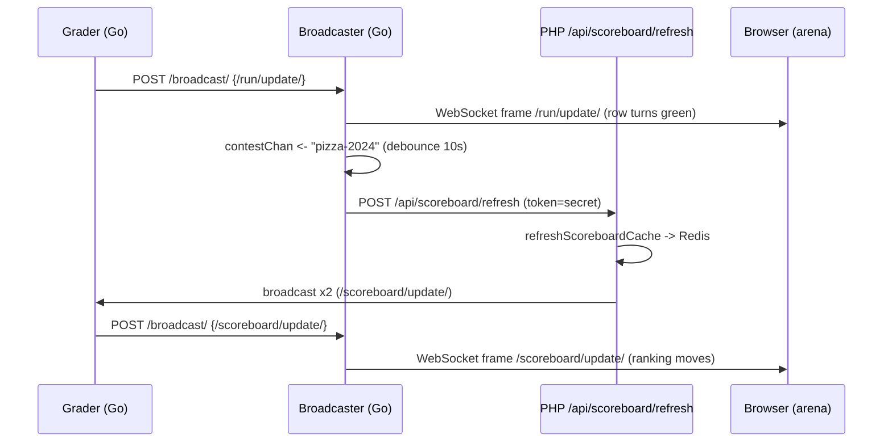

# Atualizações em tempo real

Quando você está sentado na arena e sua finalização muda de um "julgamento" giratório para um **AC** verde, ou o placar é reorganizado no instante em que um rival resolve o problema C, nada disso aconteceu porque seu navegador solicitou. Ele foi *enviado* para você por meio de um WebSocket que está aberto desde que você abriu a página do concurso. Isso é o que "atualizações em tempo real" significam no omegaUp: a arena é uma visualização ao vivo de três fluxos de eventos - **executar veredictos** (`/run/update/`), **alterações no placar** (`/scoreboard/update/`) e **esclarecimentos** (`/clarification/update/`) - entregues conforme acontecem, em vez de em um relógio de votação.

O mecanismo por trás disso é o **broadcaster**, um pequeno serviço Go no repositório separado [`omegaup/quark`](https://github.com/omegaup/quark) (o mesmo repositório que o grader e o runner — *não* o monorepo PHP). Esta página é a visualização de recursos e contratos: como são os eventos durante a transmissão, como o cliente do navegador se comporta e como uma única corrida graduada se transforma em pixels movendo-se na tela de cada participante. Para saber mais sobre o loop de distribuição, a correspondência de filtro e o modelo de confiança de duas portas, consulte [Arquitetura de transmissão](../architecture/broadcaster.md) — esta página permanece deliberadamente no nível de "o que eu obtenho e como faço para consumi-lo".

## O modelo mental de uma frase

Uma corrida graduada em um concurso produz **duas** ondas de atualizações e ajuda a manter ambas em mente desde o início:

1. Um **`/run/update/`** imediato que o avaliador publica no momento em que termina o julgamento — é isso que torna a *sua própria* linha de envio verde.
2. Um **`/scoreboard/update/`** um pouco mais tarde rejeitado que só existe porque esse veredicto pode ter alterado a *classificação* - e a classificação é calculada em PHP, não em Go, então é necessária uma viagem completa de ida e volta até o frontend e vice-versa antes de chegar ao navegador de todos.

Todo o fluxo é `grader → /broadcast/ → (scoreboard? → /api/scoreboard/refresh → recompute → /broadcast/ again) → clients`. Tudo abaixo preenche esse arco.

## Os eventos, como eles realmente chegam

O navegador abre exatamente um WebSocket e recebe todo tipo de evento nele, diferenciado por um campo interno `message`. O quadro que o soquete entrega é uma string JSON; o manipulador do cliente em [`events_socket.ts`](https://github.com/omegaup/omegaup/blob/main/frontend/www/js/omegaup/arena/events_socket.ts) `JSON.parse` o ramifica e ramifica em `data.message`. Atualmente, existem três formas que ele sabe lidar e qualquer outra coisa é ignorada silenciosamente.

### `/run/update/` — um veredicto alterado

Nascido na motoniveladora ([`cmd/omegaup-grader/frontend_handler.go`](https://github.com/omegaup/quark/blob/main/cmd/omegaup-grader/frontend_handler.go), `broadcastRun`) no instante em que uma corrida termina o julgamento. O objeto `run` da carga útil é o contrato de fio que a arena consome:

```json
{
  "message": "/run/update/",
  "run": {
    "username": "contestant1",
    "contest_alias": "pizza-2024",
    "problemset": 1234,
    "alias": "problem-c",       // the problem alias, NOT "problem_alias"
    "guid": "d41d8cd98f00b204e9800998ecf8427e",
    "status": "ready",           // always "ready" here; grading is finished
    "verdict": "AC",             // AC, PA, WA, TLE, OLE, MLE, RTE, RFE, CE, JE
    "score": 1.0,                // (0,1) fraction of cases passed
    "contest_score": 100.0,      // score scaled to the problem's contest points
    "runtime": 0.045,            // seconds
    "memory": 2048,              // bytes
    "penalty": -1,               // filled from the DB before sending
    "submit_delay": -1,          // minutes from problem-open to submit
    "language": "cpp17-gcc",
    "score_by_group": {}         // per-group scores, for group scoring modes
  }
}
```
Um caso extremo está embutido na fonte e vale a pena saber antes de você confiar em `score`: se o modo de pontuação do problema for `all_or_nothing` e a pontuação for menos que um `1` perfeito, o avaliador reescreve `score` e `contest_score` para `0` e o `verdict` para `WA` *antes* da transmissão - para que o crédito parcial nunca vaze para um exibição de tudo ou nada. O cliente, ao ver `/run/update/`, converte `run.time` de uma contagem de segundos Unix para a hora local e confirma a execução no armazenamento Vuex via `updateRun`; essa vinculação de loja é o que redesenha a linha.

### `/scoreboard/update/` — a classificação mudou

Este *não* vem direto do aluno. Ele é emitido pelo PHP no final do `\OmegaUp\Scoreboard::refreshScoreboardCache` ([`Scoreboard.php`](https://github.com/omegaup/omegaup/blob/main/frontend/server/src/Scoreboard.php)) depois de recalcular a classificação e é enviado **duas vezes** — uma para os competidores, uma vez para os administradores — porque os dois públicos veem dados diferentes:

```json
{
  "message": "/scoreboard/update/",
  "scoreboard_type": "contestant",  // or "admin"
  "scoreboard": { /* the full types.Scoreboard object */ }
}
```
A cópia `contestant` é transmitida `public: true` para que todos os participantes do concurso a recebam; a cópia `admin` é transmitida como `public: false`, portanto apenas os administradores o fazem (o filtro por mensagem do transmissor é o que impõe essa divisão - consulte a página de arquitetura). Após o recebimento, o cliente executa `processRankings`, deriva novamente a classificação e — como a carga útil do placar não carrega a série histórica de pontos ao longo do tempo — dispara uma chamada `api.Problemset.scoreboardEvents` de acompanhamento para reconstruir o gráfico de classificação. Portanto, `/scoreboard/update/` é um *empurrãozinho que traz a nova classificação, mas não o gráfico*; o gráfico é buscado novamente preguiçosamente.

### `/clarification/update/` — uma nova pergunta ou resposta

Entregue quando um esclarecimento é criado ou respondido. O cliente carimba `clarification.time` na hora local e o envia para o armazenamento de esclarecimentos, que o exibe na lista de esclarecimentos da arena:

```json
{
  "message": "/clarification/update/",
  "clarification": { /* the clarification object */ }
}
```
## O cliente do navegador: `EventsSocket`

Tudo no lado do cliente reside em uma classe, `EventsSocket` em [`events_socket.ts`](https://github.com/omegaup/omegaup/blob/main/frontend/www/js/omegaup/arena/events_socket.ts). É Vue 2.7 + TypeScript (não há gancho de API de composição `useEventStream` - o aplicativo é executado no Vue 2.7.16 e a migração do Vue 3 ainda está em andamento). Compreender seus quatro comportamentos é compreender todo o recurso do lado do consumidor.

**Como ele se conecta.** O URL é criado a partir do próprio protocolo e host da página, além do *filtro* que diz o que você deseja ouvir:

```ts
const protocol = locationProtocol === 'https:' ? 'wss:' : 'ws:';
this.uri = `${protocol}//${host}/events/?filter=/problemset/${problemsetId}`;
if (this.scoreboardToken) {
  this.uri = this.uri.concat('/', this.scoreboardToken);  // public-scoreboard link
}
// ...
const socket = new WebSocket(this.uri, 'com.omegaup.events');
```
Duas coisas a serem observadas. O subprotocolo é sempre `com.omegaup.events` — o `websocket.Upgrader` da emissora anuncia exatamente essa string, portanto, uma incompatibilidade significa que não há atualização. E a “assinatura” *não* é uma mensagem que você envia após se conectar; é o parâmetro de consulta `filter`, resolvido uma vez no momento da conexão. Um concorrente logado filtra `/problemset/<id>`; alguém seguindo um link de placar público anexa o token como `/problemset/<id>/<token>`, que permite que um visitante anônimo acompanhe um concurso sem uma sessão. Não há handshake `{type:'auth', token}` e nenhum protocolo `subscribe`/`unsubscribe` por canal — a autenticação depende do cookie de sessão `ouat` (ou um token de API) já anexado à conexão, e a autorização é decidida uma vez, antecipadamente, pelo PHP.

**Como ele permanece ativo.** Depois de aberto, o cliente envia uma string `"ping"` literal a cada `intervalInMilliseconds` (padrão **5 minutos**, `5 * 60 * 1000`) como um sinal de atividade. O transmissor, por sua vez, *descarta* tudo o que o cliente envia — seu loop de leitura existe apenas para perceber quando o soquete fecha — e envia independentemente seu próprio quadro de controle WebSocket Ping a cada `PingPeriod` (atualmente **30s**) para evitar que a conexão seja ceifada por inatividade. Portanto, ambas as extremidades estão cutucando o soquete em seus próprios temporizadores, pelo mesmo motivo: WebSockets ociosos são eliminados por proxies.

**Como ele se recupera.** Se o soquete fechar enquanto o cliente ainda o deseja (`shouldRetry`), ele tentará novamente até `retries` (padrão **10**), cada tentativa com instabilidade de até `intervalInMilliseconds / 2` para que uma reconexão em massa após a reinicialização da emissora não chegue como um rebanho trovejante. O status aparece na interface do usuário como um dos três glifos da enumeração `SocketStatus` – `↻` Waiting, `•` Connected, `✗` Failed – que é aquele pequeno indicador ativo/morto que você pode ter visto no cabeçalho da arena.

**Como ela se degrada.** Este é o recurso de suporte de carga e é por isso que a arena nunca simplesmente *para* de atualizar. Se o soquete não puder ser estabelecido, a promessa de `connect()` será rejeitada e o cliente chamará `setupPolls()`, que muda para pesquisa HTTP simples: ele chama periodicamente `api.Problemset.scoreboard` e `api.Problemset.scoreboardEvents` para classificação e `refreshContestClarifications` para esclarecimentos, tudo no mesmo relógio `intervalInMilliseconds`. Quando um soquete real é reconectado posteriormente, o `onopen` limpa esses intervalos de pesquisa para que você não faça as duas coisas. Dois casos ignoram totalmente os soquetes e vão direto para este modo mais silencioso: quando `disableSockets` está definido e quando `problemsetAlias === 'admin'` - a área de administração deliberadamente não é controlada por soquete.

## O modelo de assinatura é *filtros*, não canais

É tentador pensar no `/problemset/1234` como um canal ao qual você participa. Não é — não há estado de canal no lado do servidor. Sua conexão carrega uma lista de **predicados de filtro** e para cada mensagem o transmissor pergunta "algum dos seus filtros corresponde a este?" As cinco formas de filtro são todos caminhos de barra inicial: `/all-events` (somente administradores - a mangueira de incêndio), `/user/<username>` (seus eventos pessoais), `/problem/<alias>`, `/problemset/<id>[/<token>]` e `/contest/<alias>[/<token>]`.

A razão pela qual o filtro do navegador pode ser grosseiro (`/problemset/<id>`) enquanto você ainda nunca vê a execução privada de outro concorrente é que a correspondência é bloqueada por mensagem no servidor. Uma mensagem do concurso chega até você somente se for `Public`, ou for endereçada a *seu* nome de usuário, ou se você for um administrador desse recurso. Assim, um competidor sentado em `/problemset/1234` recebe as transmissões públicas do `/scoreboard/update/` e seu próprio `/run/update/`, mas um evento privado dirigido a outra pessoa falha em todas as cláusulas e é ignorado. Os predicados de correspondência exata estão na [página de arquitetura](../architecture/broadcaster.md#filters-how-one-message-finds-its-audience); o que importa aqui é que o filtro que você envia é uma *solicitação*, e o PHP decide se você tem permissão para isso.

!!! note "A autorização é delegada ao frontend, propositalmente"
    A emissora não tem banco de dados nem noção de quem é o administrador do concurso, por isso não pode decidir por si mesma o que você pode ouvir. Quando você se conecta, `NewSubscriber` no transmissor faz uma chamada de servidor para servidor de volta para `/api/user/validateFilter/` (`\OmegaUp\Controllers\User::apiValidateFilter`), encaminhando seu cookie/token e seu filtro solicitado. O PHP retorna quem você é - seu `user`, seja você `admin` e seus escopos `problem_admin` / `contest_admin` / `problemset_admin` - ou lança `ForbiddenAccessException`, que o transmissor retransmite como o *mesmo* status HTTP na atualização para que o soquete nunca abra. Esse endpoint intencionalmente **não** requer autenticação, que é exatamente o que permite que um detentor anônimo de token de placar acompanhe.

## Rastreando uma corrida graduada, de ponta a ponta

Suponha que você submeta o problema C no concurso `pizza-2024`, o corredor o execute e o avaliador termine com `AC`. Aqui está toda a jornada, nomeando os verdadeiros lúpulos:

1. **O avaliador publica um `/run/update/`.** `broadcastRun` cria um `broadcaster.Message` cujos campos de nível superior (`Contest`, `Problemset`, `User`, `Public`) são metadados de roteamento e cujo campo `Message` é a carga JSON *string* mostrada acima. Ele envia isso para o endpoint `/broadcast/` interno do transmissor (porta **32672**). Quando o lado *PHP* deseja transmitir, ele faz um POST para `OMEGAUP_GRADER_URL + /broadcast/` (padrão `https://localhost:21680/broadcast/`) e o avaliador o encaminha - portanto, o avaliador é sempre o último salto para o transmissor e há exatamente uma entrada.

2. **O transmissor distribui.** O manipulador `/broadcast/` enfileira a mensagem em um canal em buffer (capacidade `ChannelLength`, atualmente apenas **10** — se estiver cheio, a mensagem é *descartada* e o chamador recebe `503`, porque uma atualização obsoleta em tempo real é inútil), e o único loop `Broadcaster.Run` a entrega a todos os assinantes cujo filtro corresponde. O `onmessage` do seu navegador analisa `/run/update/` e redesenha sua linha. Concluído – para a atualização pessoal.

3. **O efeito colateral do placar é acionado.** Logo após o enfileiramento, o manipulador percebe que este era um `/run/update/` para um concurso e envia o alias do concurso para um `contestChan` interno. Isso alimenta um **debounce inicial mais final** digitado por concurso: a primeira atualização dispara uma atualização imediata *e* agenda uma atualização final `ScoreboardUpdateTimeout` (atualmente **10s**) mais tarde; quaisquer outras execuções nessa janela se fundem naquela única atualização final. Portanto, um minuto final frenético de uma competição atualiza o placar no máximo uma vez a cada 10 segundos, e não uma vez por inscrição.

4. **O frontend recalcula.** O loop debounce faz POST para `FrontendURL + api/scoreboard/refresh/` com `token = ScoreboardUpdateSecret` e `alias`. No lado do PHP, `\OmegaUp\Controllers\Scoreboard::apiRefresh` ([`Scoreboard.php`](https://github.com/omegaup/omegaup/blob/main/frontend/server/src/Controllers/Scoreboard.php)) protege a primeira linha: `if ($r['token'] !== OMEGAUP_GRADER_SECRET) throw new ForbiddenAccessException()`. O comentário aí é toda a história da confiança: *isso nunca é chamado pelos usuários finais, apenas pelo serviço de avaliação; sessões regulares não podem ser usadas porque expiram, portanto, um segredo pré-compartilhado concede privilégios de nível de administrador apenas para esta chamada.* Ele lida com concursos (`ScoreboardParams::fromContest`) e tarefas de curso (`fromAssignment`) e, em seguida, chama `refreshScoreboardCache`.

5. **O cache é reconstruído e o loop é fechado.** `refreshScoreboardCache` recalcula os placares do competidor e do administrador (além de suas séries de eventos) e os armazena no Redis via `\OmegaUp\Cache`, codificado por `problemset_id`, com um tempo limite que expira quando o concurso termina (`0` = mantido para sempre quando o concurso termina). Em seguida, ele chama `\OmegaUp\Grader::getInstance()->broadcast(...)` duas vezes — as cargas úteis do `/scoreboard/update/` descritas anteriormente — que viajam de volta através do `OMEGAUP_GRADER_URL/broadcast/`, através da niveladora, para o *mesmo* espalhamento da emissora e chegam a todos os navegadores correspondentes. A cobra come o rabo: uma atualização de corrida acionou um recálculo do placar que produziu uma transmissão do placar.


!!! dica "Se a emissora travar, nada será perdido além da vivacidade"
    A emissora não mantém banco de dados e não armazena nada em cache – é um fan-out sem estado na memória. Se ele reiniciar, cada `EventsSocket` simplesmente se reconectará (com espera instável) e a arena estará completa novamente. A única vítima são alguns segundos de atualizações push, e o substituto da pesquisa cobre até isso. É por isso que o design pode se dar ao luxo de descartar mensagens sob carga em vez de bloqueá-las: a correção reside no MySQL e no cache do placar Redis, e o soquete é apenas um acelerador nas APIs HTTP.

## Documentação Relacionada

- **[Arquitetura de Broadcaster](../architecture/broadcaster.md)** — o modelo confiável de duas portas, os predicados de correspondência de filtro e os internos do loop de distribuição.
- **[Grader Internals](../architecture/grader-internals.md)** — onde nascem os eventos `/run/update/`.
- **[The Arena](arena.md)** — a UI do concurso que consome esses streams e a enumeração do veredicto.
- **[Notificações](../development/notifications.md)** — o sistema de notificação persistente e separado (não é o mesmo que esses eventos de soquete efêmeros).
